# Informações do Projeto
`TÍTULO DO PROJETO`  

InvestPro

`CURSO` 

Engenharia de Software

## Participantes
Os membros do grupo são: 
* Gabriel Marcondes Starling Rocha
* João Eduardo Soares
* João Pedro Peres Barbosa
* Lucas José Lopes Ferreira
* Mateus Rodrigues Costa 

# Estrutura do Documento

- [Informações do Projeto](#informações-do-projeto)
  - [Participantes](#participantes)
- [Estrutura do Documento](#estrutura-do-documento)
- [Introdução](#introdução)
  - [Problema](#problema)
  - [Objetivos](#objetivos)
  - [Justificativa](#justificativa)
  - [Público-Alvo](#público-alvo)
  - [Perfil dos Usuários da Aplicação InvestPro](#perfil-dos-usuários-da-aplicação-investpro)
    - [Investidores Iniciantes:](#investidores-iniciantes)
    - [Investidores Intermediários:](#investidores-intermediários)
    - [Investidores Avançados:](#investidores-avançados)
    - [Público Geral:](#público-geral)
- [Especificações do Projeto](#especificações-do-projeto)
  - [Personas e Mapas de Empatia](#personas-e-mapas-de-empatia)
    - [Pessoas endividadas que querem aprender sobra controle financeiro e gostariam de, após sair das dívidas, começar a investir](#pessoas-endividadas-que-querem-aprender-sobra-controle-financeiro-e-gostariam-de-após-sair-das-dívidas-começar-a-investir)
    - [Pessoas que já tem um conhecimento prévio do mercado e uma vida financeira melhor estabelecida, mas com inseguranças sobre investimentos](#pessoas-que-já-tem-um-conhecimento-prévio-do-mercado-e-uma-vida-financeira-melhor-estabelecida-mas-com-inseguranças-sobre-investimentos)
    - [Jovens que desejam adquirir conhecimento na area de iniciar sua vida financeiro. E estão iniciando no mercado de investimentos com](#jovens-que-desejam-adquirir-conhecimento-na-area-de-iniciar-sua-vida-financeiro-e-estão-iniciando-no-mercado-de-investimentos-com)
  - [Histórias de Usuários](#histórias-de-usuários)
  - [Requisitos](#requisitos)
    - [Requisitos Funcionais](#requisitos-funcionais)
    - [Requisitos não Funcionais](#requisitos-não-funcionais)
  - [Restrições](#restrições)
- [Projeto de Interface](#projeto-de-interface)
  - [User Flow](#user-flow)
  - [Wireframes](#wireframes)
    - [Overview](#overview)
    - [Criar Conta](#criar-conta)
    - [Entrar](#entrar)
    - [Institucional](#institucional)
    - [Homepage](#homepage)
    - [Profile](#profile)
- [Metodologia](#metodologia)
  - [Divisão de Papéis](#divisão-de-papéis)
  - [Ferramentas](#ferramentas)
  - [Controle de Versão](#controle-de-versão)
- [Projeto da Solução](#projeto-da-solução)
  - [Tecnologias Utilizadas](#tecnologias-utilizadas)
    - [Linguagens](#linguagens)
    - [Frameworks](#frameworks)
    - [Ferramentas](#ferramentas-1)
  - [Wireframes](#wireframes-1)
    - [Registro e Login](#registro-e-login)
    - [Institucional](#institucional-1)
    - [Dashboard](#dashboard)
    - [Profile](#profile-1)
  - [User Flow](#user-flow-1)
  - [Arquitetura da solução](#arquitetura-da-solução)
- [Avaliação da Aplicação](#avaliação-da-aplicação)
  - [Cenários de Teste da Aplicação](#cenários-de-teste-da-aplicação)
  - [Plano de Testes](#plano-de-testes)
  - [Registros de Testes](#registros-de-testes)
- [Referências](#referências)

# Introdução

## Problema

Investir no mercado financeiro pode ser complicado e desafiador. Muitas pessoas têm dificuldade em entender como investir, o porquê investir e como gerenciar efetivamente seus investimentos. Além disso, o controle de investimentos pode ser confuso e demorado, especialmente ao lidar com múltiplas contas e instituições financeiras.

InvestPro enfrenta o desafio de simplificar esse processo para investidores de todos os níveis de experiência. A plataforma visa fornecer educação financeira, orientação e ferramentas para facilitar o gerenciamento e controle de investimentos, permitindo aos usuários tomar decisões mais inteligentes e maximizar seus retornos financeiros.

## Objetivos

Desenvolver um software eficiente e intuitivo para simplificar o processo de investimento, fornecendo educação financeira, orientação especializada e ferramentas de gerenciamento de investimentos, a fim de ajudar investidores de todos os níveis de experiência a tomar decisões informadas e maximizar seus retornos financeiros.

1. **Desenvolvimento de uma Plataforma Educacional:**
   Criar uma seção educacional dentro da plataforma InvestPro, oferecendo recursos como artigos, vídeos e tutoriais interativos para fornecer aos usuários conhecimentos básicos sobre investimentos, estratégias de investimento e gestão de carteiras. O objetivo é capacitar os investidores a entenderem melhor o mercado financeiro e tomarem decisões mais conscientes.

2. **Implementação de Ferramentas de Controle e Comparação de Investimentos:**
   Desenvolver ferramentas que permitam aos usuários acompanhar facilmente o desempenho de seus investimentos e facilitar a portabilidade de dados entre contas. a criação de algoritmos de análise para gerar insights relevantes sobre o desempenho dos investimentos. O objetivo é simplificar o controle e a gestão das carteiras de investimento, permitindo aos usuários otimizar seus portfólios e maximizar seus resultados financeiros.

## Justificativa

Investir dinheiro é uma atividade crucial para muitas pessoas e empresas, e pode ter um impacto significativo em seu bem-estar financeiro futuro. No entanto, o processo de investimento pode ser complexo e intimidador para aqueles que não têm experiência ou conhecimento adequado. Aqui estão algumas razões pelas quais escolhemos trabalhar com a aplicação InvestPro e definir os objetivos específicos:

1. **Democratização do Conhecimento Financeiro:**
   Muitas pessoas evitam investir simplesmente porque não entendem como funciona o mercado financeiro. Ao desenvolver uma plataforma educacional dentro do InvestPro, podemos ajudar a democratizar o conhecimento financeiro, tornando as informações sobre investimentos acessíveis e compreensíveis para um público mais amplo. Isso pode motivar mais pessoas a começarem a investir e a tomar melhores decisões financeiras para o seu futuro.

2. **Facilitar o Controle e Gerenciamento de Investimentos:**
   Gerenciar investimentos pode ser uma tarefa desafiadora, especialmente para aqueles com múltiplas contas e investimentos em diferentes instituições financeiras. Implementar ferramentas de controle e comparação de investimentos no InvestPro pode simplificar esse processo, fornecendo aos investidores uma visão clara e abrangente de seus portfólios e permitindo que façam ajustes estratégicos com base em dados. Isso pode ajudar os investidores a maximizar seus retornos e minimizar seus riscos ao longo do tempo.

3. **Promover a Confiança e Segurança dos Investidores:**
   Muitas vezes, a falta de transparência e controle pode levar os investidores a se sentirem inseguros em relação aos seus investimentos. Ao oferecer ferramentas que simplificam o processo de controle e comparação de investimentos, podemos promover a confiança e segurança dos investidores, permitindo-lhes tomar decisões mais informadas e sentir-se mais no controle de seu futuro financeiro.

## Público-Alvo

## Perfil dos Usuários da Aplicação InvestPro

### Investidores Iniciantes:
- **Conhecimentos Prévios:** Pouca ou nenhuma experiência em investimentos.
- **Relação com a Tecnologia:** Uso básico de dispositivos eletrônicos e aplicativos, mas com pouca familiaridade com plataformas de investimento.
- **Objetivo:** Aprender sobre investimentos, entender os conceitos básicos e começar a construir uma carteira de investimentos.

### Investidores Intermediários:
- **Conhecimentos Prévios:** Alguma experiência em investimentos, familiarizados com conceitos básicos.
- **Relação com a Tecnologia:** Uso regular de dispositivos eletrônicos e aplicativos, confortáveis em explorar novas plataformas.
- **Objetivo:** Aprofundar o conhecimento em investimentos, diversificar a carteira e otimizar o retorno sobre o investimento.

### Investidores Avançados:
- **Conhecimentos Prévios:** Experiência sólida em investimentos, entendimento avançado de conceitos financeiros.
- **Relação com a Tecnologia:** Proficiente no uso de tecnologia, familiarizados com ferramentas de análise financeira e investimento.
- **Objetivo:** Aperfeiçoar estratégias de investimento, maximizar retornos e gerenciar portfólios complexos com eficiência.

### Público Geral:
- **Conhecimentos Prévios:** Diversificados, desde leigos até experientes em investimentos.
- **Relação com a Tecnologia:** Varia conforme a faixa etária e experiência individual.
- **Objetivo:** Aprender sobre investimentos, acessar informações financeiras relevantes e tomar decisões informadas sobre suas finanças pessoais.
 
# Especificações do Projeto

Nesta parte do documento, serão detalhadas as especificações do projeto InvestPro, delineando os requisitos funcionais e não funcionais da aplicação. As seguintes técnicas e ferramentas serão utilizadas para realizar as especificações do projeto:

1. **Levantamento de Requisitos:**
   - Utilização de questionários, entrevistas e análise de documentos para identificar as necessidades dos usuários e as funcionalidades desejadas da aplicação.

2. **Prototipagem:**
   - Desenvolvimento de protótipos de baixa e alta fidelidade para visualizar a interface da aplicação e validar o fluxo de navegação e as funcionalidades propostas.

3. **Diagramas de Caso de Uso:**
   - Criação de diagramas de caso de uso para representar as interações entre os diferentes atores e os casos de uso da aplicação.

4. **Mapas Mentais e Diagramas de Fluxo de Dados:**
   - Elaboração de mapas mentais e diagramas de fluxo de dados para visualizar a estrutura da aplicação e o fluxo de informações entre os diferentes componentes do sistema.

5. **Feedback dos Stakeholders:**
   - Coleta de feedback dos stakeholders, incluindo investidores, consultores financeiros, administradores de instituições financeiras e outros usuários relevantes, para garantir que as especificações do projeto atendam às suas expectativas e requisitos.

## Personas e Mapas de Empatia

O processo de criação de personas é essencial para garantir que o software atenda às necessidades e expectativas dos usuários. Utilizamos a abordagem de Design Thinking para criar personas significativas e úteis.
### Pessoas endividadas que querem aprender sobra controle financeiro e gostariam de, após sair das dívidas, começar a investir 
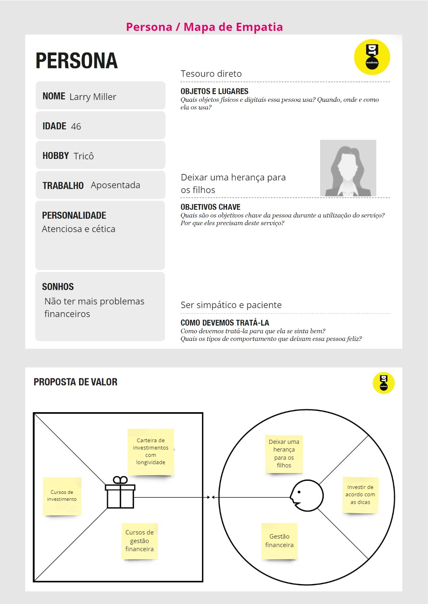
### Pessoas que já tem um conhecimento prévio do mercado e uma vida financeira melhor estabelecida, mas com inseguranças sobre investimentos 
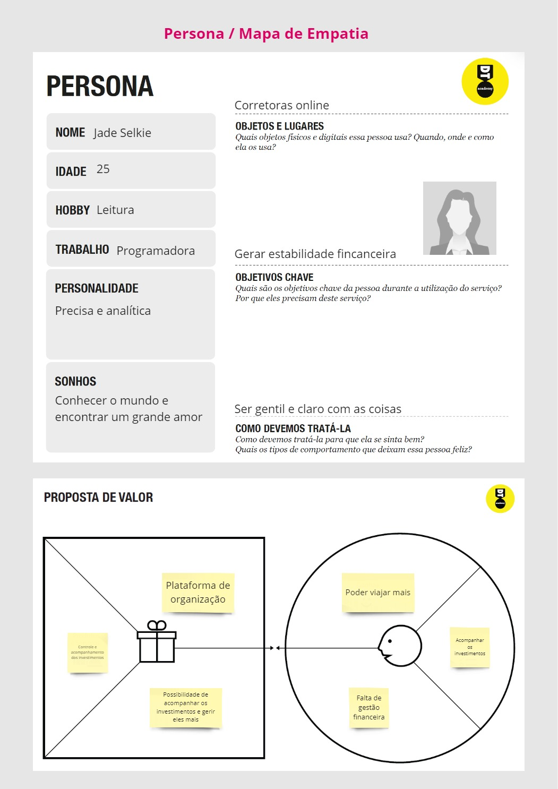
### Jovens que desejam adquirir conhecimento na area de iniciar sua vida financeiro. E estão iniciando no mercado de investimentos com
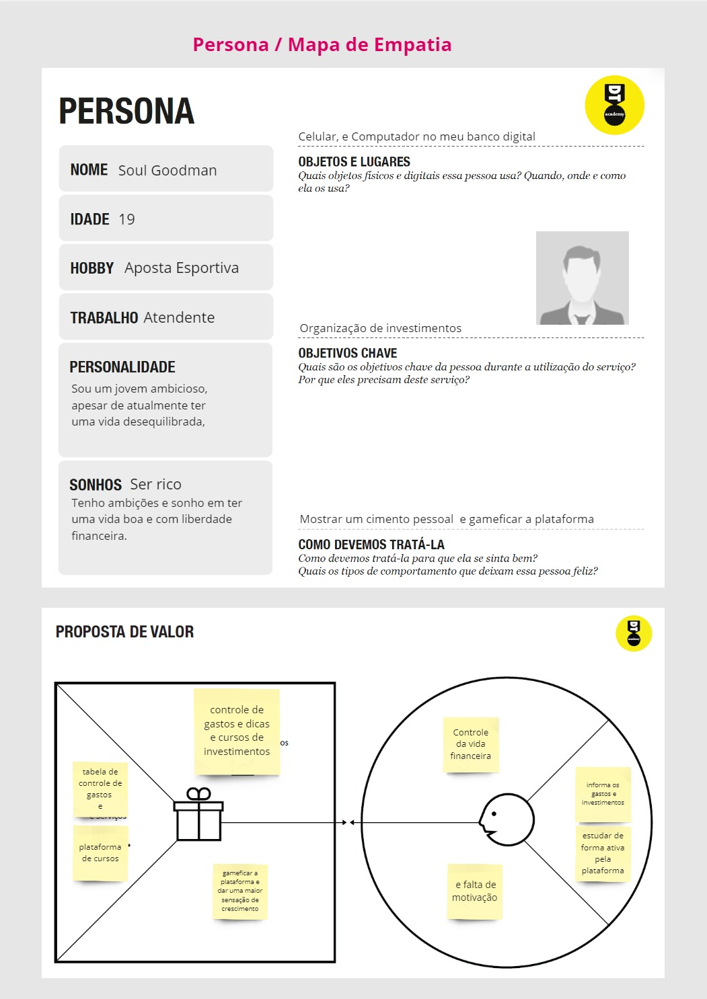

## Histórias de Usuários

Com base na análise das personas forma identificadas as seguintes histórias de usuários:

| EU COMO... | QUERO/PRECISO ...                                                      | PARA ...                                               |
|------------|------------------------------------------------------------------------|--------------------------------------------------------|
| Investidor | Registrar minha conta                                                  | Não perder minha organização financeira                |
| Investidor | Registrar meus investimentos                                           | Controlar e acompanhar meus ganhos e minhas perdas     |
| Jade       | Cadastrar minhas contas bancárias para atualização automática de dados | Manter meus investimentos centralizados                |
| Larry      | Simular possíveis investimentos                                        | Permitir uma decisão baseada em previsões de retorno   |
| Soul       | Analisar o meu perfil de investidor                                    | Saber como eu me comporto em cada situação             |
| Larry      | Visualizar os cursos disponíveis e meu progresso em cada um deles      | Manter meu conhecimento sobre investimentos atualizado |

## Requisitos

As tabelas seguintes apresentam os requisitos funcionais e não funcionais que detalham o escopo do projeto.

### Requisitos Funcionais

| ID     | Requisito                    | Descrição do Requisito                                                                                  | Prioridade |
|--------|------------------------------|---------------------------------------------------------------------------------------------------------|------------|
| RF-001 | Cadastrar investimentos      | Tela para cadastrar e centralizar informações sobre os investimentos do investidor.                     | ALTA       |
| RF-002 | Acompanhamento do Mercado    | Tela contendo preços sobre o mercado de ações nacional                                                  | MÉDIO      |
| RF-003 | Cadastrar corretoras e banco | Interface de administração para adicionar informações de parceiros.                                     | ALTA       |
| RF-004 | Simulação de investimentos   | Ferramenta para simular o crescimento do investimento com base em parâmetros definidos pelo investidor. | MÉDIA      |
| RF-005 | Feed de noticias             | Widget interativo exibindo notícias relevantes sobre investimentos.                                     | BAIXO      |
| RF-006 | Página de Perfil             | Seção com informações básicas do investido.                                                             | BAIXO      |
| RF-007 | Análise de perfil            | Página para inserir informações de perfil para recomendações personalizadas.                            | ALTA       |
| RF-008 | Plataforma de cursos         | Seção com cursos e materiais educacionais sobre investimentos.                                          | MÉDIA      |
| RF-009 | Gestão de Gastos             | Ferramenta para acompanhar os gastos do investidor                                                      | BAIXA      |
| RF-010 | Gestão de investimentos      | Seção para acompanhar os investimentos do usuário.                                                      | ALTA       |

### Requisitos não Funcionais

| ID      | Descrição do Requisito                                   | Prioridade |
|---------|----------------------------------------------------------|------------|
| RNF-001 | Atualização automática de dados                          | MÉDIA      | 
| RNF-002 | Uma plataforma com tempos de processamento abaixo dos 5s | BAIXA      | 
| RNF-003 | Respeitar as cores de base do projeto                    | BAIXA      | 

## Restrições

O projeto está restrito pelos itens apresentados na tabela a seguir.

| ID | Restrição                                             |
|----|-------------------------------------------------------|
| 01 | O projeto deverá ser entregue até o final do semestre |
| 02 | Não pode ser desenvolvido um módulo de backend        |
| 03 | Não trazer custos extras                              |

# Projeto de Interface

Nesta seção, exploraremos duas etapas cruciais do Projeto de Interface: o User Flow e os Wireframes. O User Flow mapeia o caminho que os usuários seguirão dentro da aplicação, desde o primeiro contato até a conclusão de suas tarefas. Por outro lado, os Wireframes são esboços visuais das interfaces, fornecendo uma representação estruturada e simplificada dos elementos da interface e do layout.

Ao compreendermos essas duas áreas-chave do Projeto de Interface, estaremos capacitados a criar interfaces que não apenas atendam às necessidades dos usuários, mas também proporcionem uma experiência fluida e agradável ao interagir com a aplicação. Vamos mergulhar mais fundo no User Flow e nos Wireframes para entender como eles se complementam e contribuem para o sucesso do projeto.

## User Flow

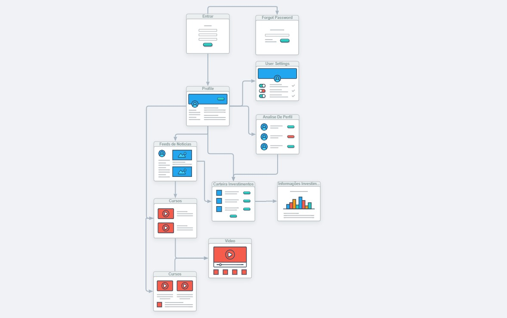

## Wireframes

Cada wireframe foi meticulosamente elaborado para representar visualmente a disposição dos elementos, a hierarquia da informação e a interação do usuário em cada página. Ao explorar os wireframes, você terá uma compreensão clara de como a InvestPro funcionará e como os usuários interagirão com ela.

Este wireframe serve como um guia essencial durante o processo de desenvolvimento, ajudando a equipe de design e desenvolvimento a visualizar e refinar a experiência do usuário antes da implementação final. Além disso, ele é uma ferramenta valiosa para solicitar feedback e realizar iterações para garantir que a InvestPro atenda às necessidades e expectativas de nossos usuários.

### Overview

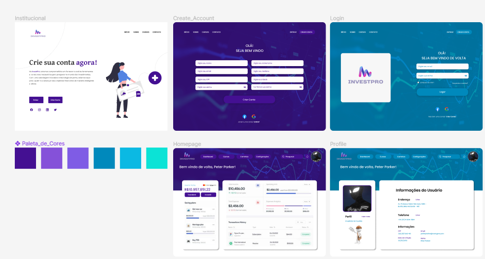

### Criar Conta

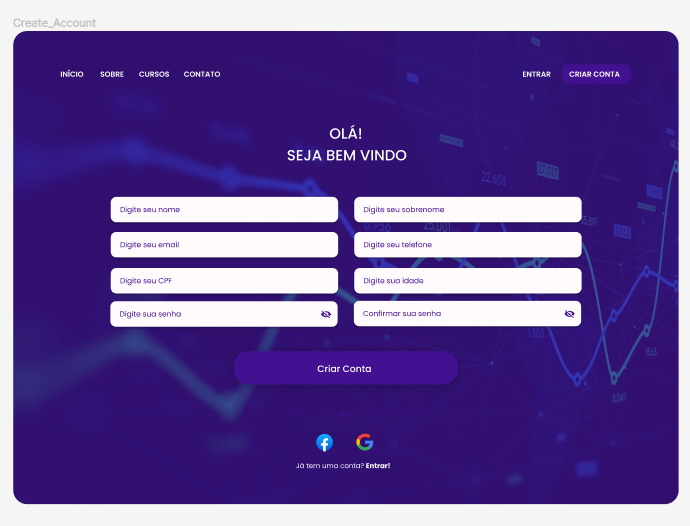

### Entrar

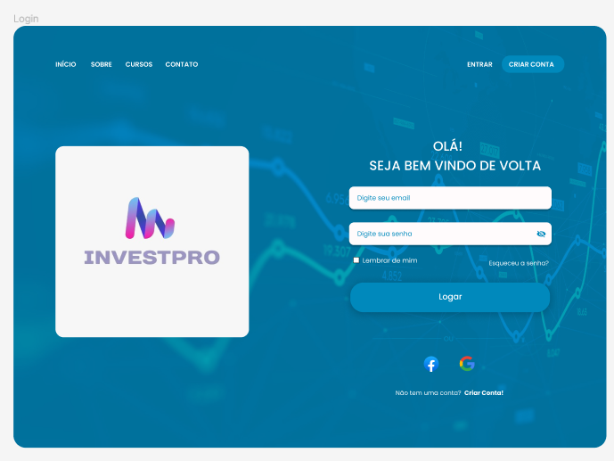

### Institucional

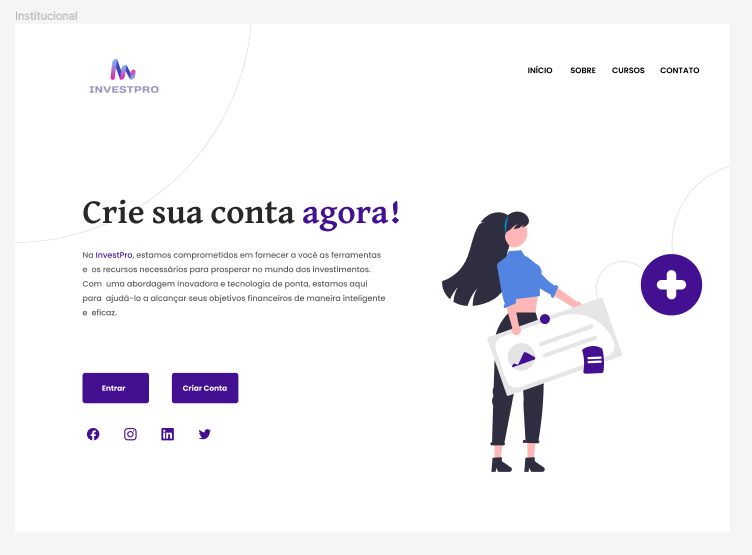

### Homepage

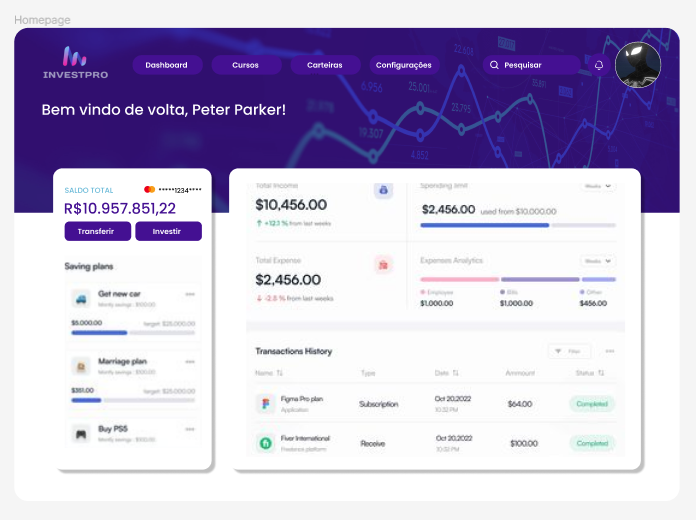

### Profile

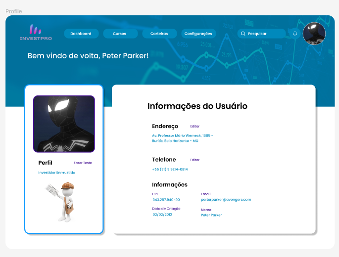

# Metodologia

Para o desenvolvimento do projeto, adotamos uma abordagem baseada em metodologias ágeis, com ênfase no Framework Scrum e no processo de Design Thinking. A seguir, descrevemos detalhes sobre como essas metodologias foram implementadas, a divisão de papéis e tarefas, as ferramentas empregadas e a gestão de configuração do projeto via GitHub.

**Processo de Trabalho:**

1. **Design Thinking:** No início do projeto, utilizamos o processo de Design Thinking para compreender as necessidades dos usuários, definir os requisitos do produto e criar soluções inovadoras. Realizamos sessões de brainstorming, entrevistas com stakeholders e prototipagem rápida para validar e iterar nas ideias.

2. **Framework Scrum:** Adotamos o Framework Scrum para gerenciar o desenvolvimento iterativo e incremental do projeto. Realizamos o planejamento, desenvolvimento, revisão e retrospectiva das atividades.

**Divisão de Papéis e Tarefas:**

- **Product Owner:** Responsável por representar os interesses dos stakeholders, definir e priorizar o backlog do produto.
  
- **Scrum Master:** Facilitador do processo Scrum, responsável por garantir que a equipe siga os princípios e práticas ágeis.

- **Equipe de Desenvolvimento:** Composta por desenvolvedores, designers e outros membros necessários para implementar as funcionalidades do produto.

**Ferramentas Empregadas:**

- **Discord:** Utilizamos o Discord como plataforma de comunicação para reuniões, discussões e acompanhamento do progresso do projeto.

- **Gestão Ágil:** Utilizamos técnicas ágeis, como reuniões diárias de stand-up, para manter a equipe alinhada e identificar possíveis impedimentos.

**Gestão de Configuração via GitHub:**

- Utilizamos o GitHub para hospedar o repositório do projeto, gerenciar o versionamento do código-fonte e colaborar de forma eficiente. 

Em resumo, adotamos uma abordagem ágil, centrada no usuário e baseada no Framework Scrum e no processo de Design Thinking. Utilizamos o Discord para comunicação, ferramentas ágeis para gestão do trabalho e o GitHub para gestão de configuração do projeto. Essas práticas e ferramentas nos permitiram desenvolver o projeto de forma colaborativa, iterativa e eficiente.

## Divisão de Papéis

Nossa equipe é composta por membros dedicados, cada um desempenhando um papel fundamental no desenvolvimento do projeto. Confira abaixo a divisão de papéis e tarefas entre os membros do grupo:

- **Product Owner (PO):** [Mateus Rodrigues](https://github.com/MateusRodrigu)

- **Scrum Master:** [João Eduardo](https://github.com/Crow3442)

- **Desenvolvedores:**
  - [Gabriel Marcondes](https://github.com/gabrielstarling1)
  - [João Pedro](https://github.com/jaoppb)
  - [Lucas](https://github.com/Lucas-Ferreira11)

## Ferramentas

| Ambiente                    | Plataforma         | Link de Acesso                   |
|-----------------------------|--------------------|----------------------------------|
| Processo de Design Thinking | Miro               | [Link](https://miro.com/)        |
| Repositório de código       | GitHub             | [Link](https://github.com/)      |
| Hospedagem do site          | GitHub Pages       | [Link](https://pages.github.com) |
| Protótipo Interativo        | Figma              | [Link](https://www.figma.com/)   |
| Plataforma de codificação   | Visual Studio Code | [Link](https://code.visualstudio.com/)|

- **Editor de código:** Utilizamos o Visual Studio Code como nosso editor de código principal. Escolhemos o VS Code devido à sua interface amigável, extensibilidade através de plugins e recursos avançados, como depuração integrada, controle de versão e suporte a várias linguagens de programação.

- **Ferramentas de comunicação:** Optamos pelo Discord como nossa principal ferramenta de comunicação. O Discord oferece salas de bate-papo por texto e voz, facilitando a comunicação em tempo real entre os membros da equipe, além de possibilitar a organização em canais específicos para diferentes tópicos e projetos.

- **Ferramentas de diagramação:** Para criar diagramas e protótipos, escolhemos o Figma. O Figma é uma ferramenta de design colaborativo baseada na web, que permite a criação de wireframes, layouts de interface do usuário e protótipos interativos. Optamos pelo Figma devido à sua facilidade de uso, recursos avançados de colaboração em tempo real e capacidade de criar designs responsivos.

- **Plataforma de hospedagem:** Escolhemos o GitHub Pages como nossa plataforma de hospedagem para o projeto. O GitHub Pages oferece hospedagem gratuita para projetos estáticos, integração contínua (CI) e entrega contínua (CD), HTTPS automático, escalabilidade automática e outras funcionalidades avançadas. Optamos pelo GitHub Pages devido à sua simplicidade de configuração, performance e segurança garantida pela infraestrutura de hospedagem da plataforma.

## Controle de Versão

O projeto está sendo feitor em branches separadas para cada funcionalidade/desenvolvedor,
ficando a cargo do mesmo escolher.

Está sendo utilizado a seguinte nomenclatura para as branches utilizadas:
 - `master`: versão principal e integrada
 - `develop`: União das branches de cada funcionalidade e integração entre elas  
 - `nome-do-dev-funcionalidade`: cada requisito funcional/feature implementado(a)
 - `template`: parte visual base do projeto

No momento as issues não estão sendo utilizadas.

# Projeto da Solução

O projeto de solução desenvolvido pela InvestPro, baseado em todos os resultados que tivemos nas fases de concepção do projeto, sendo elas: Contexto do projeto, Design Thinking e Especificações Técnicas, gerou um site para gestão de investimentos e gastos, focado na disseminação de informações através da aba de notícias, cursos e acompanhamento de ações. Todos esses artefatos juntos gerarão o nosso site que atende às necessidades de diversos níveis de investidores, desde o investidor iniciante sem nenhum tipo de conhecimento na área, pois tem acesso a diversos cursos e conteúdos para que possa iniciar esse hábito tão importante na vida financeira de todos, até os investidores mais experientes, que desejam concentrar as informações de todos os seus investimentos em apenas uma plataforma.

## Tecnologias Utilizadas

### Linguagens

Nos utilizamos 3 linguagens principais: O HTML, sendo para estruturação, marcação dos textos e seções da página, O CSS para estilização e melhoria da experiência do usuário e o JavaScript para tornar a página dinâmica, se comunicar com o Local Storage, realizar cálculos sobre os investimentos e as informações do usuário, além de consumir APIs.

### Frameworks

Cada framework não está sendo utilizado por todas as páginas mas são links padrões em todos os arquivos htmls.

Adotamos a utilização dos seguintes Frameworks:

1. Cloudflare: O Cloudflare foi usado para caching e otimização automática de recursos.

2. [Font Awesome](https://cdnjs.cloudflare.com/ajax/libs/font-awesome/5.15.4/css/all.min.css) (via CDNJS): Font Awesome é uma biblioteca de ícones que foi utilizada para adicionar ícones facilmente escaláveis a diferentes partes do site, como o menu da barra lateral, os botões de logout e outros elementos da interface de usuário (UI).

3. [Google Fonts](https://fonts.googleapis.com/css?family=Roboto:400,400i,700&display=swap) (Roboto): Google Fonts foi utilizado para importar a fonte "Roboto", que é uma fonte limpa e legível, ideal para interfaces de usuário modernas. Essa fonte foi aplicada ao corpo do site para garantir uma aparência consistente e profissional.

4. [Bootstrap CSS](https://stackpath.bootstrapcdn.com/bootstrap/4.5.2/css/bootstrap.min.css): Bootstrap é um framework CSS popular utilizado para criar layouts responsivos e componentes de UI reutilizáveis. No projeto, Bootstrap foi usado para o design responsivo, garantindo que a dashboard se adapte bem a diferentes tamanhos de tela e dispositivos.

5. [Bootstrap JS](https://stackpath.bootstrapcdn.com/bootstrap/4.5.2/js/bootstrap.min.js): O JavaScript do Bootstrap foi utilizado para fornecer interatividade adicional aos componentes de UI fornecidos pelo Bootstrap, como modais, dropdowns e tooltips. Ele trabalha em conjunto com Popper.js para garantir que esses componentes funcionem corretamente.

6. [jQuery](https://code.jquery.com/jquery-3.5.1.slim.min.js): jQuery é uma biblioteca JavaScript que simplifica a manipulação de documentos HTML, tratamento de eventos e animações. Foi utilizado para facilitar a interatividade da barra lateral e outras funcionalidades dinâmicas na página.

7. [Popper.js](https://cdn.jsdelivr.net/npm/@popperjs/core@2.9.2/dist/umd/popper.min.js): Popper.js é uma biblioteca que facilita o posicionamento de elementos popper, como tooltips e dropdowns, em uma página web. Foi utilizado em conjunto com o Bootstrap para garantir que os componentes de UI sejam posicionados corretamente e de forma responsiva.

8. [Font Awesome](https://kit.fontawesome.com/a076d05399.js) (via Kit): Este kit do Font Awesome fornece acesso a uma versão mais recente e completa da biblioteca de ícones, permitindo a utilização de ícones adicionais e funcionalidades mais avançadas, como ícones de marca e ícones interativos.

9. [Chart.js](https://cdn.jsdelivr.net/npm/chart.js): Chart.js é uma biblioteca JavaScript utilizada para criar gráficos interativos e responsivos. No projeto, foi utilizada para exibir o desempenho dos investimentos de forma visualmente atraente e fácil de entender, através de um gráfico de linha que mostra a evolução ao longo do tempo.

### Ferramentas

1. [GitHub](https://github.com): controle e versionamento do site
2. [Visual Studio Code](https://code.visualstudio.com/): codificação das funcionalidades
3. [Miro](https://miro.com): suporte a todo o processo de Design Thinking
4. [Figma](https://figma.com): criação do User Flow e dos Wireframes do projeto 

## Wireframes

### Registro e Login

Com o objetivo de salvar os dados de cada usuário, os wireframes de criar uma conta e logar em uma conta foram criados, possibilitando que cada pessoa tenha seus dados registrados de forma segura e individual.

   
   

### Institucional

Buscando atrair novos investidores para nossa plataforma essa landing page foi criada.

### Dashboard

Buscando centralizar as informações do usuário essa dashboard possibilita a fácil navegação do site e acesso prático à suas informações sobre investimentos e gastos financeiros.

### Profile

Buscando possibilitar ao usuário a alteração e visualização dos seus dados o wireframe da página de perfil foi idealizada e projetada para cumprir com esse objetivo.

## User Flow

Após a criação dos wireframes, é preciso pensar em uma forma de interligar todas as nossas ferramentas/páginas, e para isso o User Flow a seguir foi proposto, apresentando nossos requisitos nos nós presentes na imagem.

## Arquitetura da solução

Está sendo utilizando principalmente o LocalStorage para armazenamento dos dados(gastos e investimentos) e o site de hospedagem que irá disponibilizar na internet nosso projeto é o GitHub Pages, que possibilita um fácil deploy e um sistema de hospedagem gratuito.

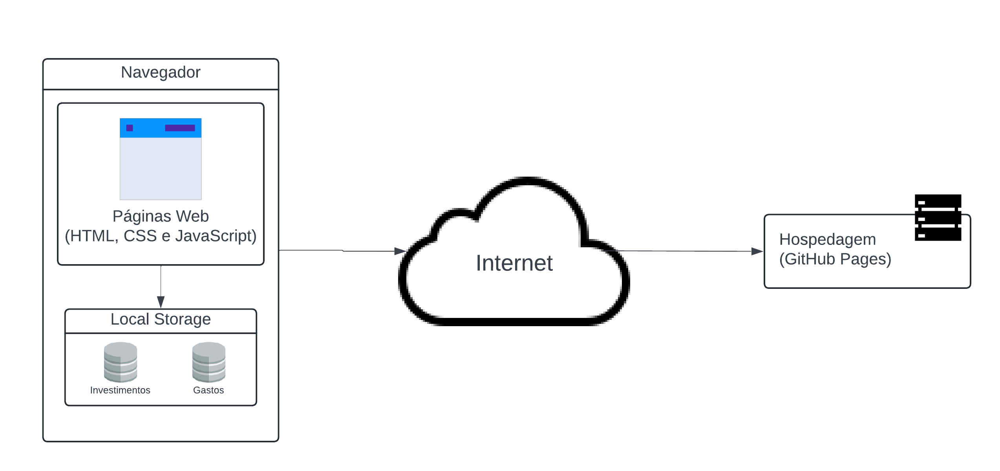

# Avaliação da Aplicação

## Cenários de Teste da Aplicação

1. **Primeiro Contato**: O usuario acessa a página principal, navega por ela e decide criar a sua conta, após cadastrar seu dados ele segue para a pagina de login e entra na plataforma.

2. **Primeira Análise**: Após o primeiro contato, o usuario tem acesso a Dashboard principal, que apresenta um resumo de todo um portifolio com dados padrões.

3. **Adquirindo Conhecimento**: Explorando mais o site, o usuário se encontra na seção de cursos da nossa plataforma, filtrando por áreas de conhecimento que ele pode ter interesse e aprendendo de forma dinâmica novos assuntos.

4. **Acompanhando o Mercado**: O usuário depois de aprender mais sobre o mundo de investimentos, acessa a área de notícias, procurando aplicar seu novo repertório em análises das notícias mais recentes do mercado financeiro, buscando aplicar seu dinheiro para atingir seu objetivo.

5. **Resumo dos Investimentos**: Depois de fazer uma análise do cenário financeiro atual, o usuário começa a investir em novos ativos e quer ter uma perspectiva de como seu dinheiro está crescendo, podendo fazer isso atráves do nosso Painel de Investimentos, que dá acesso à gráficos, indicadores, ferramentas de controle e valores totais. Além de uma ferramenta que busca ajudar no controle de gastos.

6. **Personalizando o Perfil**: Todo investidor quer saber qual é seu foco principal, seja ele conservardo, agressivo, etc., e com o nosso quiz, o usuário consegue descobrir exatamente qual deve ser seu foco na hora de realizar seus investimentos. Além de que o usuário também pode alterar e apagar seus dados a qualquer momento.

7. **Dúvidas**: Caso o usuário fique perdido nas funcionalidade do nosso site, ele pode acessar nossa área de FAQ ou entrar em contato conosco com as informações disponibilizadas.

## Plano de Testes

Os testes selecionados foram do teste 1 ao teste 6 e a seguir as justificativas e as conclusões, relacionando-os com os requisitos funcionais cumpridos:

* Os testes 1 e 2 possibilitam que o usuário tenham um vislumbre do nosso objetivo e abrem caminho para o cumprimento dos requisitos RF-001, RF-003, RF-006, RF-007, RF009 e RF-010, pois o teste 1 se relaciona com a persistência de dados de um usuário entre sessões.

* Referente ao teste 3, a buscar conhecimento na nossa plataforma de cursos é cumprido o RF-008, que possui o objetivo de educar e dismistificar o mundo financeiro.

* O teste 4 garante que o RF-005 seja validado, pois este busca a implementação de uma forma de acompanhar o mercado financeiro.

* O RF-010 se torna pronto com a nossa Dashboard, testado no teste 1, e nosso Painel de Investimentos, testado no teste 5.

* O RF-006 e RF-007 são testados pelo teste 6, pois apresentam informações dos usuários e o Quiz que mostra qual seu direcionamento.

## Registros de Testes

* **Teste 1:** ocorreu sem nenhum problema, garantindo que nosso sistema está de fato registrando novos usuários e apresenta simplificamente como é possível realizar o cadastro no nosso site.

* **Teste 2:** nos garantiu que as informações mostradas inicialmente ao usuário não está sendo feito de forma que sobrecarregue demais o investidor.

* **Teste 3:** referente aos curso nos mostra que de fato é do interesse dos iniciantes e até mesmo mais avançados investidores adquirir novos conhecimentos de forma centralizada sendo possível filtrar aquilo que é do interesse do usuário.

* **Teste 4:** foi realizado sem empecilhos, possibilitando nosso time ver que as notícias estão bem organizadas e possibilitando nossos usuários encontrar as tedências do mercado.

* **Teste 5:** nos mostrou que a interface é bem intuitiva e que mesmo aqueles com pouco conhecimento tecnológico consegue utilizar tranquilamente nosso painel.

* **Teste 6:** foi efetivo, com as pessoas que realizaram o Quiz de fato se identificando com o resultado mostrado além que também mostrou que a personalização do perfil os agradou.

* **Teste 7:** praticamente não foi realizado devido à nossa interface amigável e simples de se usar.

# Referências

* [Documentação do Bootstrap (v4.5)](https://getbootstrap.com/docs/4.5/getting-started/introduction/)
* [Documentação do JQuery](https://api.jquery.com/)
* [Referência dos Ícones do FontAwesome](https://fontawesome.com/search?o=r&m=free)
* [Documentação do Popper.js](https://popper.js.org/docs/v2/)
* [Documentação do Chart.js](https://www.chartjs.org/docs/latest/)
* [Referência de Hospedagem](https://pages.github.com/)
* [LucidChart - Diagrama de Arquitetura](https://www.lucidchart.com/pages/pt)

> Inclua todas as referências (livros, artigos, sites, etc) utilizados
> no desenvolvimento do trabalho.
> 
> **Links Úteis**:
> - [Formato ABNT](https://www.normastecnicas.com/abnt/trabalhos-academicos/referencias/)
> - [Referências Bibliográficas da ABNT](https://comunidade.rockcontent.com/referencia-bibliografica-abnt/)
